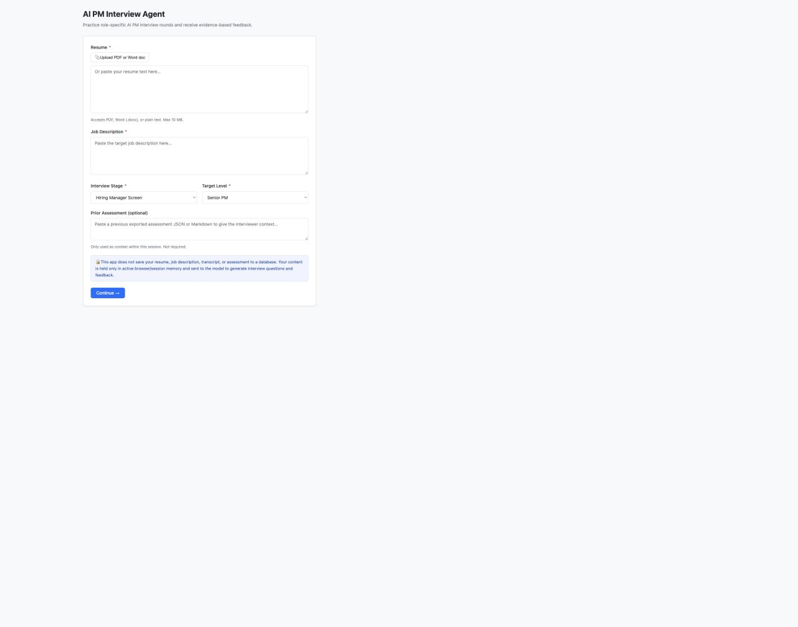
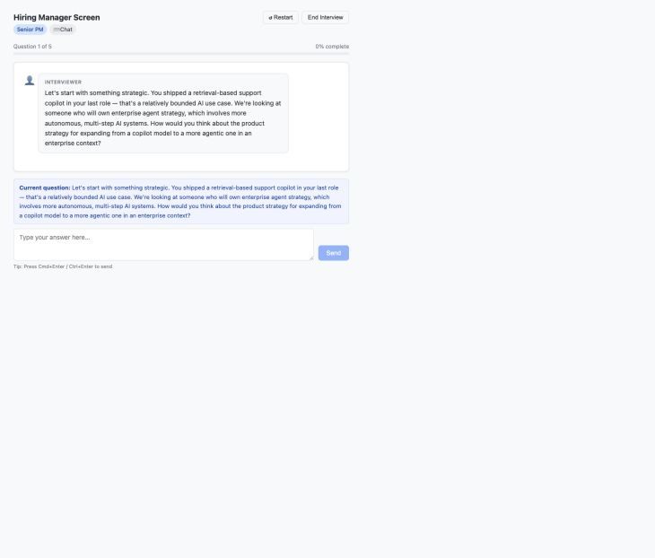
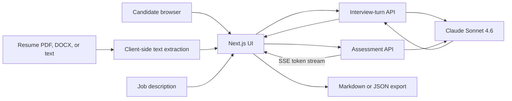

# AI PM Interview Agent

An adaptive mock-interview coach for AI Product Manager candidates. It turns a candidate's resume, a target job description, and the interview stage into a realistic practice interview, then produces evidence-based feedback and a focused seven-day practice plan.

[Try the live demo](https://ai-pm-interview-agent.vercel.app) · [View the source](https://github.com/pujagorai9/ai-pm-interview-agent)

> Built as a product and engineering prototype. It is a practice tool—not a hiring decision system.

## Product walkthrough

| Role and interview setup | Adaptive interview |
| --- | --- |
|  |  |
| Candidates upload or paste a resume, add the target job description, and select one of eight interview stages. | The agent asks one question at a time and uses the candidate's answer to decide whether to probe or move on. |

## The problem

Generic interview tools do not reflect how AI PM interviews change by stage. A recruiter, hiring manager, ML engineer, designer, and CPO test different signals—and useful feedback must be grounded in what the candidate actually said, not generic coaching advice.

This product was designed around three needs:

- rehearse the specific round a candidate is about to face;
- pressure-test AI product judgment, execution, leadership, and role fit in context; and
- turn a transcript into concrete evidence, gaps, and next practice actions.

## Who it is for

- Product Managers and Senior Product Managers preparing for AI/ML product roles
- Candidates moving between interview stages who need stage-specific practice
- Career coaches who want a structured mock interview and a portable assessment

## How it works

1. Add a resume and target job description.
2. Choose PM or Senior PM and one of eight interview stages—from recruiter screen through CEO/CPO final round.
3. Select chat or browser-based voice input.
4. Complete four or five main questions. The agent may ask one adaptive follow-up when an answer needs clarification or pressure-testing.
5. Ask the interviewer questions, as a candidate would at the end of a real interview.
6. Receive a scored report with transcript evidence, resume/JD fit, strengths, improvements, and a seven-day practice plan.
7. Export the report as Markdown or JSON and optionally use it as context in a later session.

## Key product decisions

| Decision | Why | Tradeoff |
| --- | --- | --- |
| Model the interview stage explicitly | Different interviewers test different competencies and use different tones | More prompt and test coverage than a single generic interview flow |
| Keep the interviewer neutral until the end | Preserves realistic interview conditions and avoids coaching the candidate mid-answer | Less reassurance during the session |
| Ask one question at a time with bounded follow-ups | Keeps the conversation focused while still allowing adaptive probing | The agent may not explore every interesting thread |
| Ground each scored dimension in at least three transcript details | Makes feedback inspectable and discourages unsupported ratings | Sparse or early-ended interviews leave dimensions unassessed |
| Add near-veto rules for responsible AI and ownership | Reflects two risks that should not be hidden by a strong average score | Requires careful calibration to avoid overweighting ambiguous language |
| Avoid an application database | Reduces the prototype's stored-data footprint and makes reset behavior simple | Sessions do not survive a refresh or move between devices |
| Support Markdown and JSON exports | Gives candidates a readable artifact and a machine-portable format | The user owns continuity between sessions |

## Architecture



- **Frontend:** Next.js App Router, React, and TypeScript
- **Interview orchestration:** a server route sends the resume, job description, transcript, interview plan, and current state to Claude; the model returns a constrained next-turn decision
- **Assessment:** a second server route streams the report over Server-Sent Events and attempts a JSON repair pass if the first output is malformed
- **Document input:** PDF text is extracted with PDF.js and DOCX text with Mammoth in the browser
- **Voice input:** the browser Web Speech API transcribes speech into the same answer flow used by chat
- **Deployment:** Vercel, with the Anthropic API key kept in a server-side environment variable

## Evaluation methodology

The current evaluation is a product rubric and manual functional test—not a validated predictor of interview or hiring performance.

### Rubric

Every completed interview is assessed on a 1–4 scale (`Strong No Hire` to `Strong Hire`) across:

1. AI Product Sense & Strategy
2. Execution, Metrics & Analytical Rigor
3. AI/ML Technical Depth & Judgment
4. Leadership, Influence & Behavioral
5. Communication & Interview Presence
6. Role/JD Fit

The assessment contract requires:

- at least three specific transcript details for every scored dimension;
- a concrete practice action for every improvement area;
- `Not Assessed` when an early ending leaves insufficient evidence;
- no `Strong Hire` without specific evidence in at least three dimensions;
- cautious language for resume/JD discrepancies; and
- explicit limitations for chat mode, denied microphone access, hints, or an early ending.

### Current test coverage

| Evaluation layer | Current status |
| --- | --- |
| Flow and state transitions | Manually smoke-tested across setup, mode selection, interviewing, early exit, and report generation |
| Output structure | JSON schema is enforced in prompts; malformed assessment output gets one repair attempt |
| Evidence grounding | Prompt-level requirement; report UI exposes the cited transcript evidence for inspection |
| Stage behavior | Eight stage-specific question plans, interviewer roles, and tones are implemented |
| Reliability benchmark | Not yet automated or measured across a fixed scenario set |
| Human calibration | Not yet compared with ratings from trained interviewers or real hiring outcomes |

The next evaluation milestone is a versioned test set of synthetic resumes, job descriptions, and transcripts scored for completion, schema validity, evidence attribution, stage relevance, and run-to-run consistency.

## Privacy and data handling

- The application does not persist resumes, job descriptions, transcripts, or assessments in its own database.
- PDF and DOCX text extraction happens in the browser.
- Interview context is held in React state for the active session and is cleared on refresh or reset.
- Resume text, job-description text, prior-assessment context, and interview turns are sent through server routes to Anthropic to generate questions and feedback.
- The Anthropic API key stays server-side and is not exposed to the browser.

This prototype does not yet provide user accounts, configurable retention controls, an enterprise data agreement, or per-user deletion tooling. Users should avoid entering information they are not permitted to share and should review the model provider's applicable data terms before using sensitive material.

## Results

The shipped prototype currently delivers:

- eight interview-stage variants for PM and Senior PM candidates;
- resume/JD-aware questions with bounded adaptive follow-ups;
- chat and browser speech-to-text answer entry;
- a six-dimension, evidence-backed assessment;
- resume/JD fit and candidate-question feedback;
- a seven-day practice plan; and
- portable Markdown and JSON reports.

No claims are made yet about placement rate, hiring success, scoring accuracy, or user impact. Those require a larger evaluation set and external validation.

## Limitations

- The assessment is generated by the same model family that conducts the interview; it is not an independent or calibrated hiring signal.
- Voice mode transcribes speech, but does not evaluate audio features such as tone, pace, confidence, or prosody.
- Browser speech recognition support and accuracy vary by browser and device.
- A refresh clears the current session; there is no authenticated history or cross-device sync.
- Full resume and job-description context is sent on model calls, which has privacy, latency, and cost implications.
- Long streamed assessments can occasionally fail or arrive as malformed JSON; the app performs one repair attempt and otherwise asks the user to retry.
- The public prototype does not yet include account-level authorization, rate limiting, abuse monitoring, or a formal accessibility audit.

## My ownership

I independently owned the product end to end:

- **Product:** problem framing, target user, workflow, stage taxonomy, requirements, and tradeoffs
- **AI behavior:** interviewer prompts, stage-specific question plans, adaptive follow-up policy, scoring rubric, evidence requirements, near-veto rules, and JSON contracts
- **Design:** setup flow, interview experience, assessment information hierarchy, privacy copy, and export experience
- **Engineering:** Next.js/TypeScript implementation, document parsing, browser voice input, Anthropic integration, SSE streaming, JSON recovery, and state management
- **Delivery:** deployment to Vercel, environment configuration, manual smoke testing, and iteration on report-generation reliability

## Run locally

### Prerequisites

- Node.js 20+
- An Anthropic API key

```bash
git clone https://github.com/pujagorai9/ai-pm-interview-agent.git
cd ai-pm-interview-agent
npm install
```

Create `.env.local` and add your key:

```bash
ANTHROPIC_API_KEY=your_key_here
```

Then start the app:

```bash
npm run dev
```

Open [http://localhost:3000](http://localhost:3000).

## Roadmap

- Add a repeatable evaluation harness and regression dataset
- Calibrate rubric scores with experienced AI PM interviewers
- Compare self-critique and independent-grader architectures
- Add authenticated, user-controlled history and deletion
- Improve streaming resilience and structured-output validation
- Add accessibility, browser compatibility, and abuse-prevention testing

---

If you use the demo, please treat its output as practice feedback and apply your own judgment.
